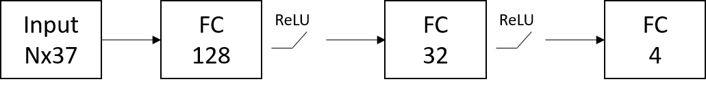
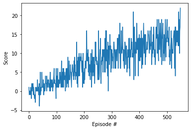
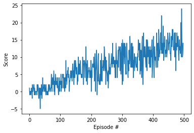
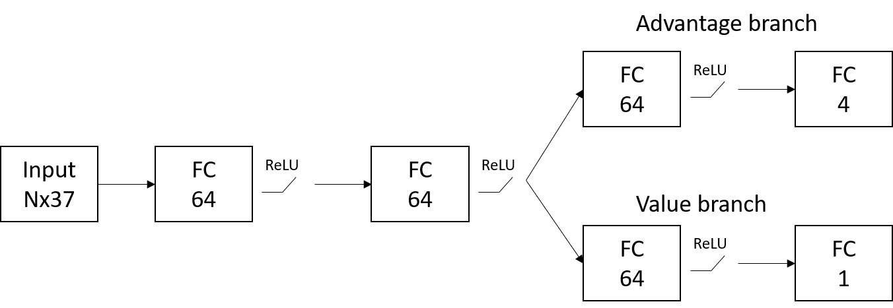
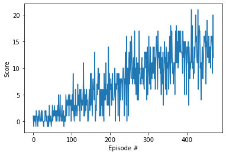

# Report
In this project, three different Deep Q-learning algorithms was implemented, namely DQN, Double DQN and Dueling DQN.

## DQN
The original algorithm Deep Q-Network (DQN) from Mnih et al. was originally used to control atari games using only raw pixels as input. It estimates the Q-function with a Deep Neural Network (DNN) and uses an experience replay buffer to perform off-line training of previously experienced state-action-reward-next_state (s, a, r, s') sets. It uses an old copy of the Q-function (Q') to estimate the estimated future reward of the next state.

The update rule is as follows

Q(s,a) = Q(s,a) + α((r + γ max(Q'(s',**a**))) - Q(s,a))

Where α is the learning rate and γ is the discount factor.

Q' is in this implementation updated using a soft update, where a portion (τ) of Q is used to update Q' after every episode.

The architecture is a simple FC network with ReLU activation functions, as seen here:

And here is the result of running the algorithm:

## Double DQN
In DQN, the action to evaluate for the next step was selected using the greedy policy and evaluated using Q'. In Double DQN the action is selected as the action that would maximize the expected future reward for Q, but it is still evaluated using Q'.

Q(s,a) = Q(s,a) + α((r + γ Q'(s',argmax_a(Q(s',**a**)))) - Q(s,a))

This lowers the risk of overestimating the q-value.

The architecture is the same as for DQN:

And here is the result of running the algorithm:

## Dueling DQN
In Dueling DQN, the network architecture is changed to have two branches, an Advantage branch and a Value branch. 
The Q value is then found by:

Q(s,a) = V(s) + (A(s,a) - mean(A(s,a)))

This allows the Q function to seperate the general value of a state (which is not related to the actions) from the individual addition from each action.

The architecture used is as follows:

And here is the result of running the algorithm:

## Hyper Parameters
The same hyper parameters were used for all three implementations:

Learning rate: 1e-4
Mini batch size: 256
Gamma: 0.95
Epsilon start: 1.0
Epsilon end: 0.01
Epsilon decay rate: 0.995
Tau : 1e-3
Experience replay buffer size: 1e5
